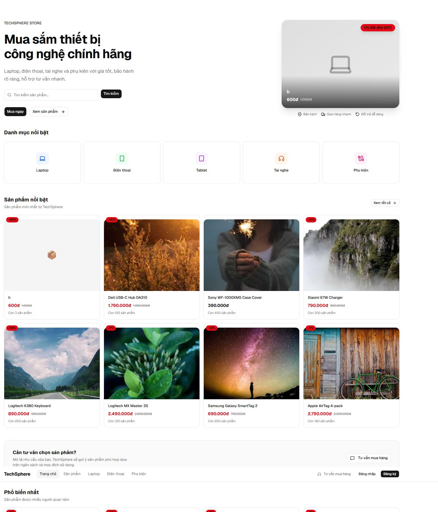
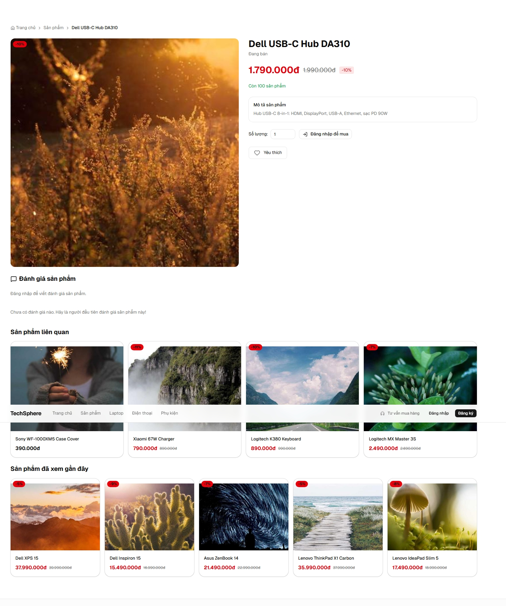
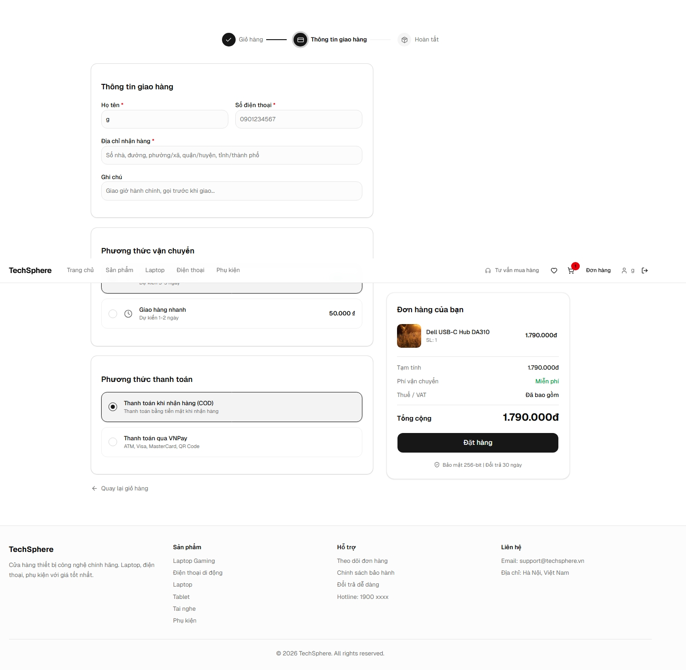

# TechSphere AI

> **AI-powered e-commerce platform** cho thiết bị công nghệ — full-stack, deployed production, kiểm thử kỹ.
> Backend FastAPI + PostgreSQL + Redis, Frontend React 19 + TypeScript. AI Search, Recommendation (gồm co-occurrence "khách mua cũng mua"), Chatbot multi-provider LLM (Gemini + Groq) với cache + fallback chain → rule-based.


**🚀 Production highlights:** `349/349` tests pass · `87%` backend coverage · atomic stock + transaction wrappers · VNPay replay-protection · multi-provider LLM (Gemini + Groq) với Redis cache + fallback chain · co-occurrence recommendation · Cloudinary CDN · N+1 optimization · GZip · Sentry · CI/CD · Light/Dark/System theme · Responsive · A11y ARIA

---

## Live Demo

| Dịch vụ | URL |
|---------|-----|
| Frontend | https://techsphere-ai.vercel.app |
| Backend API | https://techsphere-ai.onrender.com |
| API Docs (Swagger) | https://techsphere-ai.onrender.com/docs |

> Thông tin tài khoản demo sẽ được cung cấp khi cần.

---

## ✨ Why this project stands out

| Khía cạnh | Điểm nổi bật |
|---|---|
| **AI features 3 cấp** | Search (SQL ILIKE pre-filter + cap 200 candidates + Python scoring), Recommendation (cart/history/popular/**co-occurrence** SQL self-join), Chatbot (rule-based + **multi-provider LLM Gemini→Groq fallback chain**). Architecture provider abstraction, mở rộng OpenRouter/Anthropic = 1 file. |
| **Production engineering LLM** | Redis cache cho LLM response (sha256 key, TTL 1h) → cùng câu hỏi $0 quota · Provider chain Gemini lỗi → Groq → rule-based · Graceful 2 tầng (Redis down vẫn LLM, LLM down vẫn rule-based) · Endpoint chatbot luôn 200 OK · Anti-hallucination prompt (products/giá/tồn kho từ DB, không bịa, brand list pass tường minh) |
| **Backend hardening sprint** | 5 PRs: config guardrails (production env validate) · atomic transaction wrapper (create_order + cancel rollback) · stock atomicity (conditional UPDATE WHERE stock>=:q anti-oversell) · VNPay hardening (amount verify + replay protection qua UNIQUE txn_ref + CANCELLED state lock) · perf polish (smart_search down to SQL, cart GET pure read) |
| **Test coverage thật** | 349 tests, 87% coverage — integration tests cho cart/order/payment flow, edge cases SQL injection/XSS, anti-API-call guard cho LLM tests, prompt-structure smoke tests |
| **Hệ thống Audit Log** | Mọi action admin (CRUD product, đổi role, xóa review, export, bulk inventory...) được log có thể truy vết — không phải feature trang trí, có 10 tests |
| **A11y + Dark mode** | ARIA labels đầy đủ, focus management, mobile menu role nav, Light/Dark/System theme toggle với localStorage persistence, scroll reset on route change |
| **CI/CD ready** | GitHub Actions chạy pytest + frontend build trên mọi PR, deploy auto lên Render + Vercel |

---

## 🎬 Demo flow

Quy trình trải nghiệm 7 bước trên live demo:

1. **Browse** — Vào trang chủ → xem hero + featured products → filter theo category/brand/price ở `/products`
2. **AI Search** — Gõ "laptop gaming dưới 30 triệu" trên search bar → SQL ILIKE pre-filter + Python relevance scoring
3. **Product detail** — Click sản phẩm → xem ảnh optimized (Cloudinary), reviews, section **"Có thể bạn cũng thích"** (co-occurrence "khách mua sản phẩm này cũng mua"), add to wishlist
4. **Cart → Checkout** — Add to cart → `/cart` (stock validation atomic) → `/checkout` → chọn VNPay sandbox → quay về `/payment/result` (verify amount + replay protection)
5. **AI Chatbot** — Vào `/chat` → mô tả nhu cầu ("cần laptop làm văn phòng và edit ảnh") → nếu env có `GEMINI_API_KEY`, LLM rephrase reply tự nhiên với product context thật từ DB; lỗi/quota → tự fallback Groq → rule-based
6. **Reviews & Wishlist** — Đánh giá đơn hàng đã hoàn thành, quản lý wishlist
7. **Admin** — Login admin → `/admin/dashboard` (stats, charts) → quản lý products/orders → bulk update tồn kho → export CSV đơn hàng → xem Audit Log

Theme toggle (Sun/Moon/Monitor) ở header — thử Light/Dark/System bất cứ lúc nào.

---

## Tính năng chính

### Người dùng
- Đăng ký / Đăng nhập (JWT authentication)
- Đổi mật khẩu, quên mật khẩu (gửi email qua Resend)
- Duyệt sản phẩm theo danh mục, thương hiệu (75+ sản phẩm thật, ảnh từ Unsplash CDN)
- Tìm kiếm sản phẩm thông minh (AI Search) + autocomplete
- Giỏ hàng + Checkout với stock validation
- Thanh toán online (VNPay sandbox)
- Lịch sử đơn hàng, chi tiết đơn hàng
- Đánh giá sản phẩm (Reviews & Ratings)
- Yêu thích (Wishlist)
- Hồ sơ cá nhân
- Sản phẩm đã xem gần đây (Recently Viewed)
- **Light/Dark/System theme** với persistence
- **Responsive UI** mobile-first (375px+)

### Tính năng AI
- **AI Search** — Tìm kiếm sản phẩm theo relevance score, fuzzy matching
- **AI Recommendation** — Gợi ý dựa trên giỏ hàng, lịch sử, phổ biến, **co-occurrence** ("khách mua sản phẩm này cũng mua")
  - Co-occurrence: SQL self-join trên `order_items` tính số đơn cùng chứa anchor + co-product. Fallback chain: co-occurrence → cùng category → popular → latest.
  - Endpoint: `GET /api/ai/recommend?strategy=co_occurrence&product_id=<id>&limit=5` (public)
- **AI Chatbot** — Tư vấn sản phẩm theo nhu cầu, ngân sách, thương hiệu
  - Mặc định **rule-based** (intent matching theo category/brand/budget/needs)
  - **Tùy chọn**: multi-provider LLM (Gemini + Groq) với cache + fallback chain. Set `AI_LLM_ENABLED=true` + `AI_PROVIDERS=gemini,groq` + key tương ứng trong `.env`.
  - **Production engineering**:
    - **Redis cache** cho LLM response (TTL 1h mặc định, `AI_LLM_CACHE_TTL_SECONDS=0` để disable) — cùng câu hỏi trong window → hit cache, $0 quota.
    - **Provider fallback chain** — Gemini lỗi/quota → tự động thử Groq → hết providers → rule-based. No single point of failure.
    - **Graceful degradation** — Redis down → bỏ cache, vẫn gọi LLM. LLM down → rule-based. Chatbot luôn 200 OK.
  - Sản phẩm/giá/tồn kho luôn lấy từ DB (không bịa). Brand list pass tường minh để LLM không gợi ý hãng không có trong cửa hàng.

### Quản trị (Admin)
- Dashboard thống kê (doanh thu, đơn hàng, sản phẩm, người dùng, biểu đồ)
- Quản lý sản phẩm (CRUD, upload hình ảnh Cloudinary)
- Quản lý đơn hàng (cập nhật trạng thái, xuất CSV)
- Quản lý người dùng (phân quyền, kích hoạt/vô hiệu hóa)
- Quản lý đánh giá (xem, xóa đánh giá vi phạm)
- Quản lý kho hàng (bulk update tồn kho)
- Nhật ký hệ thống (Audit Log)
- Quản lý danh mục, thương hiệu (CRUD)

---

## Công nghệ sử dụng

| Lớp | Công nghệ |
|-----|-----------|
| **Backend** | FastAPI 0.136, SQLModel, PostgreSQL 16, Alembic |
| **Frontend** | React 19, Vite, TypeScript, Tailwind CSS, shadcn/ui |
| **Quản lý state** | Zustand, TanStack Query |
| **Xác thực** | JWT (python-jose), bcrypt (passlib) |
| **Cache** | Redis (graceful degradation — app vẫn chạy nếu không có Redis) — dùng cho product list, category/brand, LLM response |
| **AI / LLM** | Multi-provider abstraction (httpx REST): Gemini API + Groq API (OpenAI-compat). Fallback chain provider → rule-based. Redis cache TTL 1h cho LLM response |
| **Upload hình ảnh** | Cloudinary (auto WebP/AVIF, resize, CDN) |
| **Báo lỗi** | Sentry (error tracking + performance monitoring) |
| **Email** | Resend (transactional email) |
| **Biểu đồ** | Recharts (admin dashboard) |
| **Thanh toán** | VNPay (sandbox, HMAC-SHA512 verify, replay protection qua UNIQUE txn_ref) |
| **Nén truyền** | GZip middleware (Starlette) |
| **Kiểm thử** | Pytest, httpx, pytest-cov, GitHub Actions |
| **Triển khai** | Render (Backend + DB + Redis), Vercel (Frontend) |

---

## Kiến trúc hệ thống

```
┌─────────────────────────────────────────────────────────┐
│                   Frontend (Vercel)                      │
│            React + Vite + TypeScript + Tailwind          │
│         OptimizedImage (Cloudinary transforms)           │
└──────────────────────────┬──────────────────────────────┘
                           │ HTTPS
                           ▼
┌─────────────────────────────────────────────────────────┐
│                   Backend (Render)                        │
│              FastAPI + SQLModel + Alembic                 │
│                                                           │
│  ┌─────────┐ ┌──────────┐ ┌─────────┐ ┌──────────────┐  │
│  │  Auth   │ │ Product  │ │  Cart   │ │  AI Engine   │  │
│  │  User   │ │ Category │ │  Order  │ │ Search/Rec/  │  │
│  │ Review  │ │  Brand   │ │ VNPay   │ │   Chatbot    │  │
│  └─────────┘ └──────────┘ └─────────┘ └──────────────┘  │
│                                                           │
│  LLM Chain:  CachedProvider → ChainProvider               │
│              └ Gemini → Groq → rule-based (fallback)      │
│                                                           │
│  ┌───────────────────┐  ┌─────────────────────────────┐  │
│  │   Redis Cache     │  │      Sentry Monitoring      │  │
│  │ product 5min,     │  │   (error tracking, perf)    │  │
│  │ category 30min,   │  │                             │  │
│  │ LLM resp 1h       │  │                             │  │
│  └───────────────────┘  └─────────────────────────────┘  │
└──────────────────────────┬──────────────────────────────┘
                           │
                           ▼
┌─────────────────────────────────────────────────────────┐
│            PostgreSQL (Render) + Redis (Render)           │
└─────────────────────────────────────────────────────────┘

┌─────────────────────────────────────────────────────────┐
│                   Cloudinary CDN                          │
│         Image storage + auto format (WebP/AVIF)          │
│         Resize on-the-fly via URL transforms             │
└─────────────────────────────────────────────────────────┘
```

### Kiến trúc Backend (4-Layer Pattern)

```
Request → API (router.py) → Service (service.py) → Repository (repository.py) → Database
                                   ↓
                              Schema validation (schemas.py)
```

```
backend/app/
├── api/            # API endpoints (router)
├── core/           # Config, database, cache, rate_limit
├── models/         # SQLModel models
├── repositories/   # Data access layer
├── schemas/        # Pydantic schemas (request/response)
├── services/       # Business logic
│   └── llm/        # LLM provider abstraction
│       ├── base.py        # BaseLLMProvider + LLMError
│       ├── gemini.py      # GeminiProvider (REST)
│       ├── groq.py        # GroqProvider (OpenAI-compat)
│       ├── chain.py       # ChainProvider (fail-through)
│       ├── cache.py       # CachedProvider (Redis wrap)
│       └── factory.py     # get_llm_provider()
└── main.py         # FastAPI app entry (CORS, GZip, routers)
```

---

## Ảnh chụp màn hình

> Để README nhẹ, ảnh không commit vào repo. Đặt 6 file dưới đây vào thư mục `docs/screenshots/` để hiển thị (file lớn được khuyến nghị `.gitignore`).

| Màn hình | Đường dẫn |
|---|---|
| 🏠 Trang chủ (hero + featured + categories) | `docs/screenshots/homepage.jpg` |
| 📱 Mobile responsive (375px) | `docs/screenshots/Mobile Homepage.jpeg` |
| 🛒 Chi tiết sản phẩm | `docs/screenshots/productdetail.jpeg` |
| 💬 AI Chatbot tư vấn | `docs/screenshots/AI Chat.jpeg` |
| 💳 Checkout với VNPay | `docs/screenshots/Checkout.jpeg` |
| 📊 Admin Dashboard (stats + charts) | `docs/screenshots/Admin Dashboard.jpeg` |

<!--
Khi đã có ảnh, uncomment khối dưới đây:







-->

Các màn hình khác (không hiển thị inline để giữ README gọn): Product list/filter, Cart, Order Detail, Wishlist, Login/Register, Admin Products/Orders/Users/Reviews/Audit Log, Payment Result, 404, Search Autocomplete, Forgot/Reset Password.

---

## Cài đặt local

### Yêu cầu
- Python 3.11+
- Node.js 20+
- PostgreSQL 16+
- Redis (tùy chọn — app vẫn chạy bình thường nếu không có Redis)

### Backend

```bash
cd backend
python -m venv venv
source venv/bin/activate       # macOS/Linux
# .\venv\Scripts\Activate.ps1  # Windows
pip install -r requirements.txt
```

Tạo file `.env` từ mẫu:

```bash
cp .env.example .env
# Chỉnh sửa DATABASE_URL và các biến môi trường khác
```

Chạy migration và seed dữ liệu:

```bash
alembic upgrade head
python -m app.seed
```

Khởi động server:

```bash
uvicorn app.main:app --reload --host 0.0.0.0 --port 8000
```

- Swagger UI: http://localhost:8000/docs
- ReDoc: http://localhost:8000/redoc

### Frontend

```bash
cd frontend
npm install
npm run dev
```

Truy cập: http://localhost:5173

---

## Kiểm thử

### Backend

```bash
cd backend
pytest tests/ -v                    # Chạy tất cả tests
pytest tests/ -v --cov=app          # Chạy với coverage report
```

**349/349 tests** — 87% coverage, phân bố qua 29 test modules:

| Module | Số lượng | Nội dung |
|--------|----------|----------|
| test_ai | 26 | Search, recommend (cart/history/popular/**co-occurrence + fallback chain**), chat |
| test_chat_llm | 22 | Gemini provider, factory, chat fallback paths, **prompt-structure smoke tests** |
| test_llm_chain_cache | 29 | Groq provider, **ChainProvider fail-through, CachedProvider hit/miss/Redis-down**, factory chain |
| test_order | 27 | Create, status update, **atomic rollback, stock atomicity (anti-oversell), cleanup stale items** |
| test_user_management | 17 | List, get, update, phân quyền, role escalation, **admin self-demote block** |
| test_cart | 12 | Add, update, delete, stock validation, **GET không mutate DB** |
| test_payment | 12 | VNPay create, return success/fail, **amount mismatch, replay protection, cancelled order lock** |
| test_brand | 13 | CRUD, phân quyền, pagination, duplicate slug |
| test_category | 13 | CRUD, phân quyền, pagination, duplicate slug |
| test_cache | 13 | Cache key, get/set, invalidate, no-Redis graceful degradation |
| test_review | 13 | Create, list, delete, rating stats |
| test_email | 12 | Resend integration, template render, error handling |
| test_wishlist | 11 | Add, remove, list, duplicate handling |
| test_audit_log | 10 | Log creation, list, action types, export |
| test_admin_reviews | 10 | List reviews, delete review, filter by product |
| test_forgot_password | 10 | Token generation/expiry/SHA-256 hash, reset flow |
| test_order_export | 10 | CSV export, date filter, status filter, UTF-8 BOM |
| test_product_crud | 10 | CRUD, filter, search, soft delete, pagination |
| test_auth | 10 | Register, login, JWT, get_current_user |
| test_admin_stats | 9 | Dashboard stats, charts data, recent orders, top products |
| test_bulk_stock_update | 9 | Bulk inventory update, inline stock editing |
| test_upload | 9 | Cloudinary upload, file type validation, size limit |
| test_products | 8 | Product list filter, search, pagination, sort |
| test_edge_cases | 8 | Inactive user, SQL injection, XSS, invalid params |
| test_change_password | 7 | Verify old password, update, JWT remains valid |
| test_config | 6 | Production env validation (SECRET_KEY, ADMIN_PASSWORD, CORS_ORIGINS) |
| test_logging | 6 | Request/response logging middleware |
| test_health | 5 | Health check, DB status, Redis status |
| test_gzip | 2 | GZip compression, response body readable |

### Frontend

```bash
cd frontend
npm run build
```

### CI/CD

GitHub Actions tự động chạy khi push hoặc PR vào nhánh `main`:
- Backend: cài đặt dependencies + chạy pytest
- Frontend: cài đặt dependencies + build production

---

## Triển khai

Dự án sử dụng kiến trúc:
- **Frontend**: Vercel (auto-deploy từ GitHub)
- **Backend**: Render Web Service (auto-deploy từ GitHub)
- **Database**: Render PostgreSQL
- **Cache**: Render Redis (tùy chọn)
- **Image CDN**: Cloudinary
- **Error Tracking**: Sentry
- **Email**: Resend

Hướng dẫn deploy chi tiết: [docs/DEPLOYMENT.md](docs/DEPLOYMENT.md)
API Endpoints: [docs/API_ENDPOINTS.md](docs/API_ENDPOINTS.md)

---

## Trạng thái dự án

### Đã hoàn thành (Month 1 + 2 + 3 + Hardening Sprint)

**Core Features:**
- Đăng ký, đăng nhập, phân quyền (JWT)
- Đổi mật khẩu, quên mật khẩu (Resend email)
- Quản lý danh mục, thương hiệu, sản phẩm (CRUD)
- Giỏ hàng, checkout, đơn hàng
- Thanh toán VNPay (sandbox)
- Đánh giá sản phẩm (Reviews & Ratings)
- Yêu thích (Wishlist)
- Sản phẩm đã xem (Recently Viewed)

**AI Features:**
- **AI Search** — SQL ILIKE pre-filter (đẩy filter xuống DB) + cap 200 candidates + Python relevance scoring (name=10đ/kw, desc=3đ/kw)
- **AI Recommendation** — 4 chiến lược:
  - `cart` (dựa giỏ hàng — cùng category/brand)
  - `history` (dựa lịch sử mua hàng)
  - `popular` (đơn hàng nhiều nhất toàn shop)
  - `co_occurrence` ("khách mua A cũng mua B" — SQL self-join `order_items`, fallback chain: co-occurrence → cùng category → popular → latest)
- **AI Chatbot** — Multi-provider LLM với fallback:
  - Rule-based default (intent matching category/brand/budget/needs)
  - Optional LLM (Gemini, Groq, mở rộng OpenRouter dễ): provider abstraction `BaseLLMProvider`, `ChainProvider` (fail-through), `CachedProvider` (Redis sha256 key TTL 1h)
  - Anti-hallucination: products/giá/tồn kho luôn từ DB, brand list pass tường minh để LLM không gợi ý hãng không có
  - Polished prompt: persona "nhân viên tư vấn", anti-clichés explicit, 3-câu cấu trúc, follow-up có điều kiện
  - Endpoint chatbot LUÔN 200 OK — mọi lỗi LLM (timeout, quota, parse) → fallback rule-based im lặng

**Admin Features:**
- Dashboard thống kê (stats, charts, recent orders)
- Quản lý sản phẩm (CRUD, hình ảnh Cloudinary)
- Quản lý đơn hàng (cập nhật trạng thái, xuất CSV)
- Quản lý người dùng (phân quyền, kích hoạt, **chặn admin tự demote**)
- Quản lý đánh giá (xem, xóa)
- Bulk update tồn kho
- Nhật ký hệ thống (Audit Log)

**Backend Production Hardening Sprint (5 PRs):**
- **PR #1 Config guardrails** — Production env validate `SECRET_KEY`/`ADMIN_PASSWORD` không phải default, `CORS_ORIGINS != '*'`, gate `create_db_and_tables` chỉ dev
- **PR #2 Transaction foundation** — `create_order` + cancel path atomic (session.add/flush/commit + try/rollback)
- **PR #3 Stock atomicity** — Conditional `UPDATE products SET stock=stock-:q WHERE id=:id AND stock>=:q` anti-oversell (portable Postgres + SQLite)
- **PR #4 VNPay hardening** — Verify `int(vnp_Amount) == round(total*100)`, reject nếu `status==CANCELLED` hoặc `payment_status!=PENDING`, lưu `vnp_TxnRef` UNIQUE chống replay
- **PR #5 Perf & UX polish** — `smart_search` đẩy ILIKE xuống SQL + cap 200 (bỏ `limit=10000`); `_build_cart_response` pure read; checkout cleanup stale items atomically

**Technical:**
- Redis caching (product 5min, category/brand 30min, **LLM response 1h**, graceful degradation)
- Image optimization (Cloudinary transforms, lazy loading, WebP/AVIF)
- GZip compression
- N+1 query optimization (batch find_by_ids)
- Rate limiting (slowapi)
- Logging middleware
- Sentry error tracking
- Seed dữ liệu (75 sản phẩm, 9 thương hiệu, 5 danh mục, ảnh thật từ Unsplash)
- **349/349 tests**, 87% coverage
- CI/CD (GitHub Actions)
- Triển khai production (Render + Vercel)

**UI/UX:**
- Hero banner hiện đại với gradient, AI badge, social proof, floating product cards
- Light/Dark/System theme toggle (next-themes + Tailwind class variant)
- Responsive mobile-first (375px+)
- Accessibility: aria-label cho icon buttons, role nav cho mobile menu, ARIA cho admin dropdown, id/htmlFor cho form, aria-hidden cho decorative emojis
- Semantic tokens (bg-card, bg-popover, bg-muted) — dark mode không vỡ giao diện
- Order/payment status badges có dark variant
- **Code splitting** 22 routes lazy-loaded, initial bundle 934→405 KB (−57%), gzip 267→128 KB (−52%)
- **Scroll reset on route change** (`ScrollToTopOnNavigate`) — fix SPA mặc định giữ scrollY khi navigate
- **"Có thể bạn cũng thích" section** trên product detail dùng co-occurrence recommendation

---

## Giấy phép

Dự án phục vụ mục đích học tập và portfolio.
